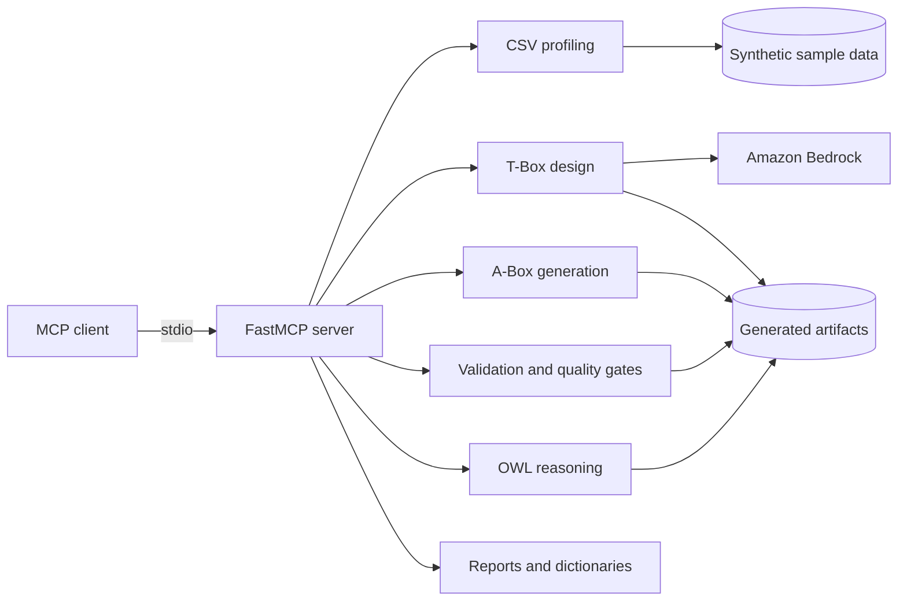

# Ontology Agent MCP Server

Ontology Agent is a **local stdio MCP server** sample for a domain-neutral
knowledge-graph lifecycle. It profiles CSV data, designs a T-Box, generates an
A-Box, applies validation and quality gates, performs OWL reasoning, and
supports SPARQL queries and reports for the resulting graph.

This repository is sample code for demonstrating one concept and workflow; it
is not a general-purpose utility or library for operating AWS services. The
included 200-minute guided workshop is an end-to-end example of that workflow
for data engineers, knowledge-graph engineers, solution architects, and domain
experts using an MCP client and Amazon Bedrock. Read what the server does
first, then use the [included workshop](#included-workshop-guided-example) for
the hands-on path.

> [!WARNING]
> This is sample code, for non-production usage. You should work with your
> security and legal teams to meet your organizational security, regulatory,
> and compliance requirements before deployment.

Korean: [README.ko.md](README.ko.md)

<a id="the-workshop"></a>

## Included workshop (guided example)

The included workshop is designed as a self-service guided example. An
instructor can facilitate the session, but participants can complete the labs
with the checked-in guides and pre-generated artifacts. Lecture slides are not
included. The 30-minute ontology foundations segment uses the
[ontology foundations section](workshop/participant-workbook.md#온톨로지-기초-강의-30분)
of the participant workbook, which an instructor can present or a participant
can read alone.

| Time | Activity | Learning objective |
|---:|---|---|
| 10 min | Environment check | Confirm the MCP server and sample data are available |
| 30 min | Ontology foundations | Understand triples, T-Box, A-Box, and open-world reasoning |
| 55 min | Data and T-Box labs | Profile CSV data and review an ontology design |
| 45 min | A-Box, reasoning, and validation | Build and test a knowledge graph |
| 40 min | SPARQL and competency questions | Query the graph and evaluate answers |
| 20 min | Capstone | Plan a small adaptation for another domain |
| **200 min** | **Total** | **Model, validate, query, and adapt** |

Use these documents in order:

1. [Setup guide](workshop/setup-guide.md)
2. [Participant workbook](workshop/participant-workbook.md)
3. [SPARQL cheatsheet](workshop/sparql-cheatsheet.md)
4. [Post-workshop guide](workshop/post-workshop-guide.md)
5. [Instructor guide](workshop/instructor-guide.md), if you are facilitating

Participants directly exercise the following 27 MCP tools. Other registered
tools support pipeline internals, optional integrations, diagnostics, or
post-workshop advanced work and are not required during the 200-minute session.

| Workshop phase | Tools |
|---|---|
| State and reset | `check_pipeline_state`, `reset_pipeline_state` |
| Questions and data | `generate_competency_questions`, `list_csv_tables`, `read_csv_schema`, `generate_csv_erd`, `profile_csv_data` |
| T-Box design | `generate_tbox_collaborative`, `read_tbox`, `analyze_tbox`, `improve_tbox_quality`, `measure_tbox_metrics`, `update_tbox_incremental` |
| T-Box validation | `validate_ttl_syntax`, `check_quality_rules`, `validate_owl_consistency`, `classify_tbox`, `validate_tbox_shacl` |
| Tacit knowledge | `add_tacit_from_natural_language`, `generate_tacit_from_rules`, `generate_tacit_from_data`, `skip_tacit_knowledge` |
| Graph review | `visualize_tbox`, `generate_abox`, `validate_kg` |
| Query evaluation | `sparql_local`, `test_domain_queries` |

The fallback package under `workshop/pre-generated/` lets participants run the
query and validation labs without invoking the model-assisted T-Box step.
Validate it before a session:

```bash
python scripts/verify_workshop_sparql.py --ignore-placeholders
```

## Architecture



The supported sample deployment is a local stdio MCP process. Neo4j and
GraphDB integrations are optional. Exposing the server over a network is
outside this sample's scope.

## Prerequisites

| Requirement | Purpose |
|---|---|
| Python 3.11 or later | Server and workshop scripts |
| An MCP client | Guided tool invocation |
| AWS credentials and Bedrock model access | Model-assisted steps |
| Java 25 or later | Full HermiT and Pellet validation paths |

Use the standard AWS SDK credential provider chain and least-privilege
permissions. Do not store credentials in this repository.

## Cost considerations

Most profiling, conversion, validation, reasoning, and query operations run
locally. Amazon Bedrock model charges apply to the model-assisted tools,
especially competency-question generation and collaborative T-Box design.
`generate_semantic_dictionary`, which the pipeline runs before A-Box
generation and again after inference, also calls Bedrock when any class has a
Korean description (`description_ko`) but no English description
(`description_en`). That call sends those class names and descriptions to the
model for translation. The pre-generated package lets the query and
validation labs skip the collaborative T-Box step, but it does not remove every
model call. Most classes in the bundled T-Box have only Korean descriptions, so
regenerating the semantic dictionary from it, as workbook step 6-2a does, sends
those classes to Bedrock for translation. The workshop steps that generate
competency questions, add tacit knowledge from natural language, or update the
T-Box incrementally also call Bedrock. Optional remote stores can add
infrastructure charges.

## Quick start

```bash
git clone https://github.com/aws-samples/sample-industrial-ontology-mcp-server.git ontology-agent
cd ontology-agent
python3 -m venv venv
source venv/bin/activate
python -m pip install --upgrade pip
python -m pip install -r requirements.txt
cp .env.example .env
```

Configure `AWS_REGION`, `BEDROCK_REGION`, and `BEDROCK_MODEL_ID` in `.env`.
Copy `.mcp.json.example` to `.mcp.json`, replace its paths with absolute paths,
and restart the MCP client.

Verify workshop content:

```bash
python scripts/verify_workshop_sparql.py --ignore-placeholders
```

## Run the sample workflow

Ask the MCP client:

```text
Build an ontology from the sample data.
```

`CLAUDE.md` defines the guided state machine and approval checkpoints.
Competency-question and tacit-knowledge branches wait for a user choice.
Destructive or external deployment actions require explicit confirmation.

## Generated outputs

Generated files are local and are not committed:

```text
data/generated/
  tbox/t_box.ttl
  abox/a_box.ttl
  inferred/all_inferred.ttl
  reports/pipeline_report.html
  reports/tbox_visualization.html
  reports/query_test_report.html
  semantic_dictionary.json
  pipeline_state.json
```

Treat generated results as hypotheses until a domain expert reviews their
classes, relationships, constraints, and query answers.

## Security

- Use synthetic or explicitly approved data only.
- Treat model-generated RDF, SPARQL, and Cypher as untrusted input.
- Keep `.env`, `.mcp.json`, credentials, and generated artifacts out of Git.
- Keep file operations within the documented project directories.
- Use least-privilege IAM and database identities.
- Do not enable remote write tools unless the workflow requires them.
- Do not expose the stdio server as a remote service without a separate
  security design and review.

See the [threat model](docs/security/threat-model.md).

## Project status and end of life

This repository is maintained as long as the MCP server sample remains active
and its checked-in server workflow and included workshop example can be
validated against supported dependencies. End of life is triggered when the
sample is retired, when its demonstrated workflow moves to a successor sample,
or when required dependencies can no longer be maintained safely. At that
point maintainers may archive the repository after publishing a final status
notice. This statement defines triggers, not a promise of a particular archive
date.

The repository contains tests, but it does not publish a hosted CI workflow.
Maintainers run the documented checks explicitly before a release.

## Cleanup

Remove generated outputs and deactivate the local environment:

```bash
rm -r data/generated
deactivate
```

Remove any optional Neo4j or GraphDB resources separately. Confirm the exact
target before deleting a remote repository or database.

## Troubleshooting

- If the MCP tools are missing, verify absolute paths in `.mcp.json` and fully
  restart the MCP client.
- If Bedrock returns `AccessDeniedException`, verify the selected Region,
  model access, and IAM permission.
- If Java validators are unavailable, continue with the local workshop
  fallback and record which validators were skipped.
- If a workshop code block fails, rerun
  `python scripts/verify_workshop_sparql.py --ignore-placeholders` and fix the
  first reported document and line.

Additional references are indexed in [docs/README.md](docs/README.md).

## License

This project is licensed under [MIT-0](LICENSE). See
[THIRD-PARTY-LICENSES.md](THIRD-PARTY-LICENSES.md) for bundled dependency and
data notices.
